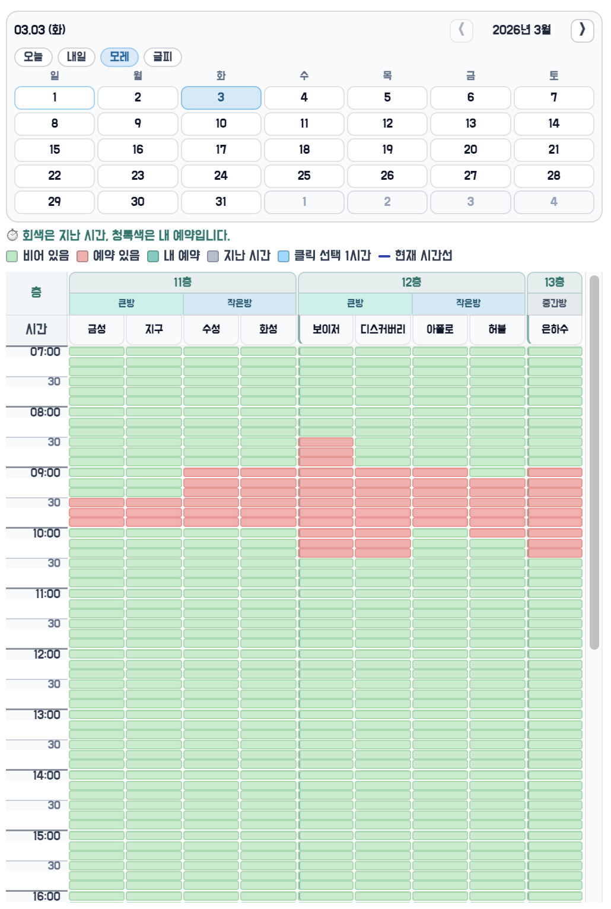
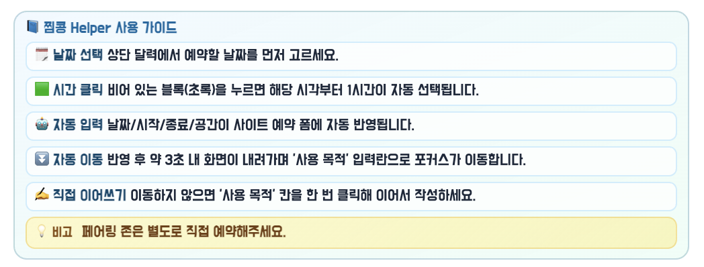
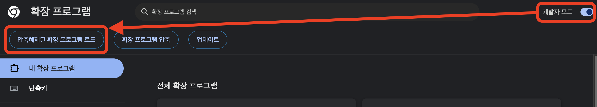

# 📌 찜콩 Helper (Chrome Extension)

찜콩 사이트에서 **층/회의실별 타임테이블을 한눈에 확인**하고,
빈 시간 블록 클릭만으로 **날짜/시간/공간을 예약 폼에 자동 반영**해주는 Chrome 확장입니다. ✨

- 대상 사이트: `https://zzimkkong.com/`
- 제작: **8기 프론트엔드 파라디**

---

## 🚀 1) 프로그램 소개

찜콩 Helper는 예약 과정에서 반복되는 조작(날짜/시간/공간 선택)을 줄이고, 회의실별 예약 현황을 한눈에 볼 수 있도록 돕습니다.

핵심 목적
- ✅ 예약 가능한 시간을 빠르게 파악
- ✅ 빈 시간 선택 즉시 예약 폼에 자동 입력
- ✅ 사용자는 곧바로 `사용 목적` 입력으로 이어짐

주요 기능
- 🗂️ 층/방 기반 타임테이블 표시
- ⏱️ 10분 단위 시간 블록 표시
- 📍 현재 시간선 및 지난 시간 비활성화
- 🖱️ 빈 블록 클릭 시 → 1시간 자동 선택
- 🔔 예약 설정 완료 시 토스트 안내
- 📝 사용 목적 입력란 자동 포커스 + 스크롤
- 📅 커스텀 날짜 선택 UI + 빠른 선택 버튼(`오늘/내일/모레/글피`)
- 📚 사용 가이드(매뉴얼) 접기/펼치기

---

## 🖼️ 2) 화면 예시

아래 이미지들을 통해 동작을 확인할 수 있습니다.

### 2-1. 메인 타임테이블


### 2-2. 자동 반영 후 토스트


### 2-3. 매뉴얼 펼침 상태


---

## 🛠️ 3) GitHub에서 받아 Chrome 확장 적용하기

### 3-1. 코드 받기

#### 방법 A: Git clone (권장)

```bash
git clone https://github.com/JetProc/zzimkkong-helper.git
cd zzimkkong-helper
```

#### 방법 B: ZIP 다운로드

1. GitHub 저장소 접속
2. `Code` 버튼 클릭 → `Download ZIP`
3. ZIP 압축 해제

---

### 3-2. 크롬 확장 프로그램 등록

1. Chrome 주소창에 `chrome://extensions` 입력
2. 우측 상단 `개발자 모드` ON
3. `압축해제된 확장 프로그램을 로드합니다` 클릭
4. 프로젝트 폴더(※ `manifest.json` 위치) 선택



---

### 3-3. 정상 로드 확인

- 확장 목록에 `찜콩 Helper` 카드가 보이는지 확인 ✅
- 에러 배지가 없는지 확인 ✅
- 필요 시 확장 새로고침(↻)

### 3-4. 사이트에서 동작 확인

1. `https://zzimkkong.com/guest/...` 페이지 접속
2. 좌측 영역(`#root > div > aside`) 상단에 Helper UI 표시 확인
3. 날짜/시간 클릭 시 폼 자동 반영 동작 확인

---

## 📚 4) 사용 매뉴얼

### 4-1. 기본 사용 순서

1. 상단 날짜 UI에서 날짜 선택
2. 타임테이블에서 빈 시간 블록 클릭
3. 1시간 자동 선택 및 예약 폼에 날짜/시작/종료/공간 자동 반영
4. 예약 영역 접힘 → 사용 목적 입력란으로 스크롤/포커스
5. `사용 목적` 입력 후 예약 진행

### 4-2. 색상 / 상태 안내

- 🟩 초록: 예약 가능
- 🟥 빨강: 예약 있음
- ⚪ 회색: 지난 시간 또는 선택 불가
- 🟦 하늘색: 방금 자동 선택된 1시간 구간
- ➖ 진한 가로선: 현재 시간선

### 4-3. 빠른 날짜 버튼

- `오늘` / `내일` / `모레` / `글피`

---

## 🏢 5) 층/공간 구성

- 11층
  - 큰방: 금성, 지구
  - 작은방: 수성, 화성
- 12층
  - 큰방: 보이저, 디스커버리
  - 작은방: 아폴로, 허블
- 13층
  - 중간방: 은하수

---

## 🔔 6) 토스트 안내 메시지 (예시)

- 자동 선택 실패(겹침/범위 초과)
- 날짜 정보 누락
- 사이트 폼 자동 반영 실패
- 예약 세팅 완료 안내

---

## ⚠️ 7) 트러블슈팅

### Q1. 확장이 로드되지 않아요

1. `manifest.json`이 있는 폴더를 선택했는지 확인
2. `chrome://extensions`에서 에러 로그 확인
3. 확장 새로고침 후 페이지 강력 새로고침(`Cmd+Shift+R`) 수행

### Q2. 사이트에서 UI가 안 보여요

1. URL이 `https://zzimkkong.com/guest/*` 형식인지 확인
2. 로그인/권한 상태 확인
3. 페이지가 SPA이므로 URL 이동 후 잠시 대기

### Q3. 자동 반영이 실패해요

1. 해당 시간에 예약 가능한 공간이 있는지 확인
2. 시작/종료 시간이 운영 범위 내인지 확인
3. 사이트 DOM 구조 변경 시 셀렉터 보정 필요

---

## 🗂️ 8) 프로젝트 구조

```text
zzimkkong-helper/
├─ manifest.json
├─ README.md
└─ src/
   ├─ background.js
   ├─ content.js
   ├─ icon.png
   ├─ fonts/
   │  └─ BMDOHYEON_ttf.ttf
   └─ vendor/
      └─ toastify-js/
         ├─ toastify.min.js
         └─ toastify.min.css
```

---

## 📜 9) manifest 요약

`manifest.json` 기준

- `manifest_version: 3`
- `content_scripts`
  - 매치: `https://zzimkkong.com/guest/*`
  - 로드: `toastify.min.js`, `content.js`
- `web_accessible_resources`: 아이콘, 폰트 사용
- `host_permissions`: `zzimkkong.com` / `k8s.zzimkkong.com`

---

## 🏷️ 10) 라이선스 / 제작

- 프로젝트명: **찜콩 Helper**
- 제작: **8기 프론트엔드 파라디**